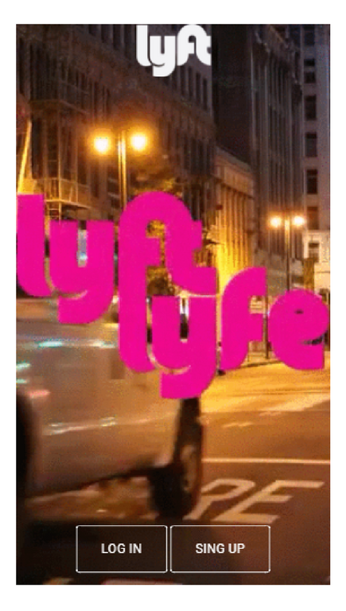
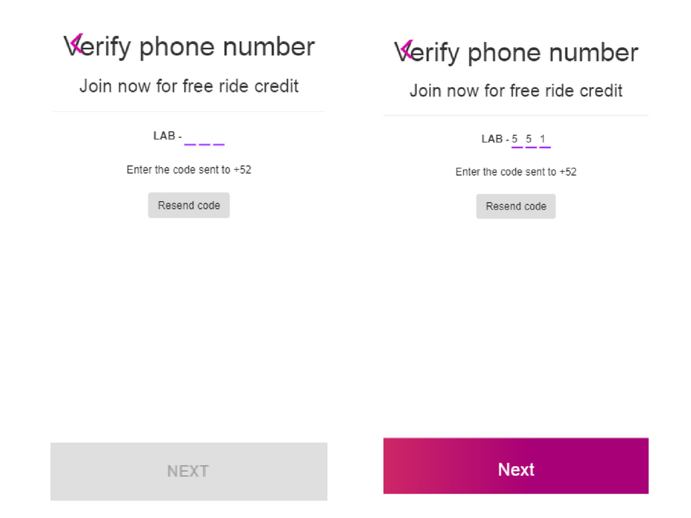

# Lyft - Jquery

* **Track:** _Common Core_
* **Curso:** _Crea tu propia red social_
* **Unidad:** _Agiliza tu desarrollo_

***
### Se puede acceder a este proyecto en [Github](https://lizbethfp.github.io/lyft-jquery/ "Github")
***

## Objetivo
---
El reto consiste en realizar una aplicación móvil con la ayuda del framework Bootstrap y la librería de Javascript Jquery. Dicha aplicación debe inicializar con una animación del logo. Luego, debe redigirse a la vista principal, donde se presenta dos botones para iniciar sesión y registrarse. Al darle clic a registrarse, se redireccionará a una vista que permite escoger el código internacional de los países e ingresar el número telefónico de diez dígitos. Al cumplir con esta solicitud, se habilita el botón para dirigirse a la siguiente vista gracias a un código aleatorio que se brinda con una alerta. En la siguiente vista, se verifica el número telefónico mediante el código aleatorio brindado anteriormente. Al cumplir con esto, se habilita el botón para pasar a la siguiente vista. En la siguiente vista, se solicita el nombre, apellido y correo electrónico, además de seleccionar el checkbox para habilitar el botón para pasar a la siguiente vista. Al seleccionar el botón, se redireccionará a la vista final. La aplicación deberá verse de la siguiente forma para cada una de sus fases:

#### Vista splash

#### Vista principal

### Vista que permite escoger el país con el código internacional de teléfono e ingresar 10 dígitos

#### Muestra de código aleatorio al habilitar el botón

#### Verificación de número telefónico mediante el código aleatorio y habilitación de botón

#### Vista de registro con llenado de datos: nombre, apellido y correo electrónico y habilitación de botón

#### Vista final

## Autora
Lizbeth Félix Peña

## Fecha
24/12/2017
